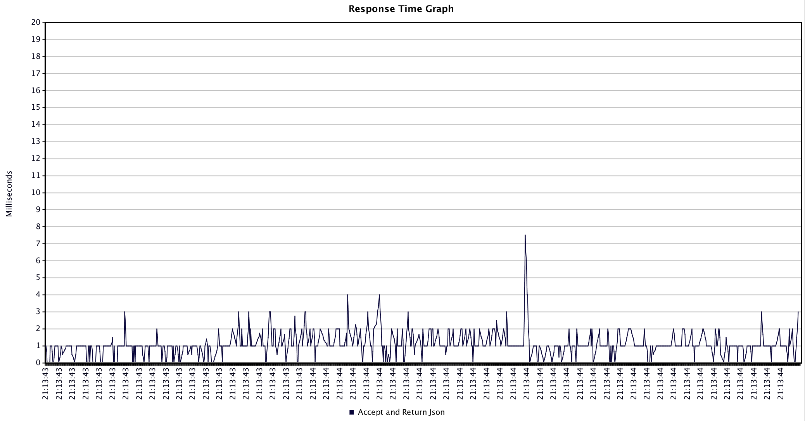

# Perf Results
This performance test sees how many requests standard go and node apps (no external frameworks or libs) can receive and return json via a POST endpoint.

Each app was started, then given a few test runs before the results were recorded.

JMeter was used with 1000 threads for the thread group.

Node was tested with clustering turned on and off.

## Go
```go

```




## Node with Cluster
```js

```


## Node
```js

```


