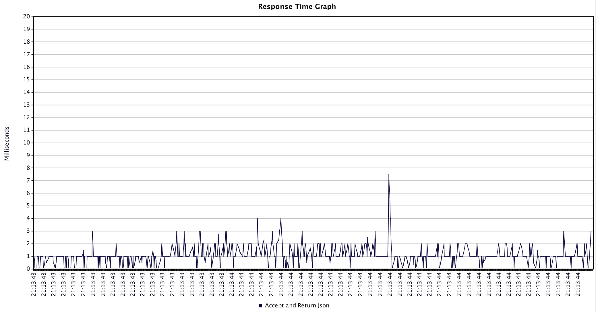
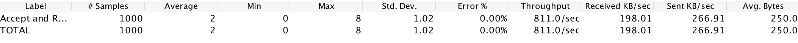
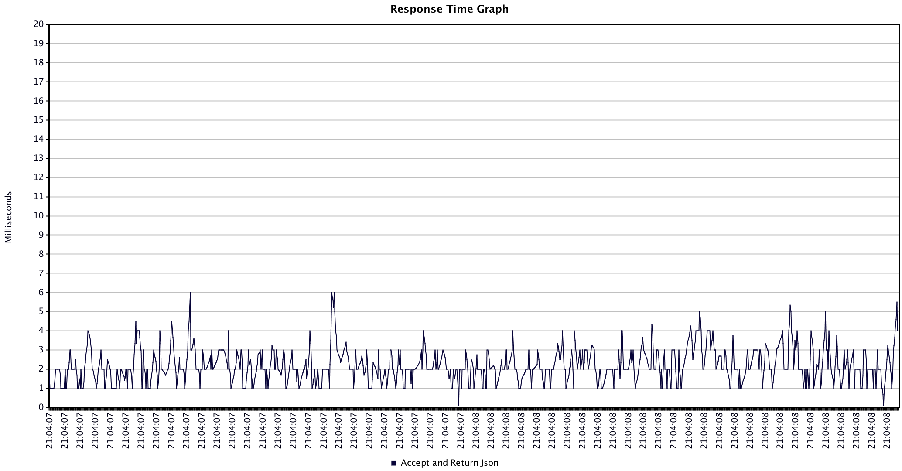
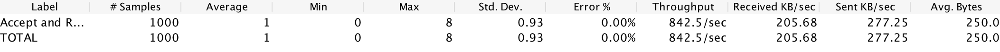
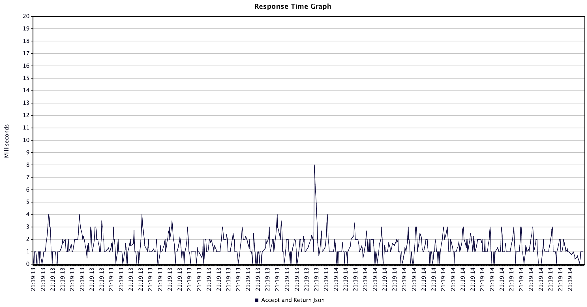

# Perf Results
This performance test sees how many requests standard go and node apps (no external frameworks or libs) can receive and return json via a POST endpoint.

Each app was started, then given a few test runs before the results were recorded.

JMeter was used with 1000 threads for the thread group.

Node was tested with clustering turned on and off.

Performance between Node and Go appears to be relatively the same in terms of throughput (number of requests per second)

## Go
```go
func acceptAndReturnJson(response http.ResponseWriter, request *http.Request) {
	if request.Method != "POST" {
		http.Error(response, "not found", 404)
		return
	}
	b, err := ioutil.ReadAll(request.Body)
	defer request.Body.Close()
	if err != nil {
		http.Error(response, err.Error(), 500)
		return
	}
	jsonObject := &AcceptAndReturnJsonRequest{}
	err = json.Unmarshal(b, jsonObject)
	if err != nil {
		http.Error(response, err.Error(), 500)
		return
	}
	sendJsonResponse(response, *jsonObject)
}
```




## Node with Cluster
```js
function acceptAndReturnJson(request, response){
  if (request.method != 'POST'){ return notFoundReponse(request, response); }
  let body = '';
  request.on('data', function(data){
    body += data;
  });
  request.on('end', function(data){
    let json = JSON.parse(body);
    sendJsonResponse(json, response);
  });
}
```




## Node
```js
function acceptAndReturnJson(request, response){
  if (request.method != 'POST'){ return notFoundReponse(request, response); }
  let body = '';
  request.on('data', function(data){
    body += data;
  });
  request.on('end', function(data){
    let json = JSON.parse(body);
    sendJsonResponse(json, response);
  });
}
```





