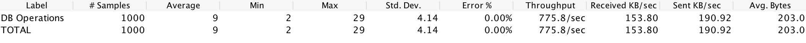

# Perf Results
This performance test sees how many requests standard go and node apps (no external frameworks or libs) can receive and return json via a POST endpoint.

Each app was started, then given a few test runs before the results were recorded.

JMeter was used with 1000 threads for the thread group.

Node was tested with clustering turned on and off.

Go was slightly faster in terms of throughput, compared to Node with clustering.

Go did have consistent response times, whereas Node tended to fluctuate.

## Go
```go
func dbOperations(response http.ResponseWriter, request *http.Request) {
	if request.Method != "POST" {
		http.Error(response, "not found", 404)
		return
	}
	b, err := ioutil.ReadAll(request.Body)
	defer request.Body.Close()
	if err != nil {
		http.Error(response, err.Error(), 500)
		return
	}
	jsonObject := &DbOperationsRequest{}
	err = json.Unmarshal(b, jsonObject)
	if err != nil {
		http.Error(response, err.Error(), 500)
		return
	}

	conn := getDbConnection()
	//insert
	insertQuery :="insert into db_operations (stringColumn, intColumn) values (?, ?)"
	_, lastInsertId := dbUpdate(conn, insertQuery, jsonObject.StringColumn, jsonObject.IntColumn)
	//read
	query := "select * from db_operations where id = ?"
	rows := dbQuery(conn, query, lastInsertId)
	//delete
	deleteQuery := "delete from db_operations where id = ?"
	_, _ = dbUpdate(conn, deleteQuery, lastInsertId)
	//return result
	result := []DbOperationsResult{}
	for rows.Next() {
		var dbOperationsResult DbOperationsResult
		err = rows.Scan(&dbOperationsResult.ID, &dbOperationsResult.StringColumn, &dbOperationsResult.IntColumn)
		if err != nil {
			panic(err.Error()) // proper error handling instead of panic in your app
		}
		result = append(result, dbOperationsResult)
	}
	rows.Close()
	sendJsonResponse(response, result)
}

```



## Node with Cluster
```js
async function dbOperations(request, response){
  let jsonRequest = await getJsonRequest(request);
  //insert
  let insertQuery = `insert into db_operations set ?`;
  let insertRows = await dbQuery({query:insertQuery, data:jsonRequest});
  let insertId = insertRows.insertId;
  //retrieve the inserted row
  let query = `select * from db_operations where id = ${insertId}`;
  let result = await dbQuery({query});
  //delete the inserted row
  let deleteQuery = `delete from db_operations where id = ${insertId}`;
  await dbQuery({query:deleteQuery});
  sendJsonResponse(result, response);
}
```


## Node
```js
async function dbOperations(request, response){
  let jsonRequest = await getJsonRequest(request);
  //insert
  let insertQuery = `insert into db_operations set ?`;
  let insertRows = await dbQuery({query:insertQuery, data:jsonRequest});
  let insertId = insertRows.insertId;
  //retrieve the inserted row
  let query = `select * from db_operations where id = ${insertId}`;
  let result = await dbQuery({query});
  //delete the inserted row
  let deleteQuery = `delete from db_operations where id = ${insertId}`;
  await dbQuery({query:deleteQuery});
  sendJsonResponse(result, response);
}

```


