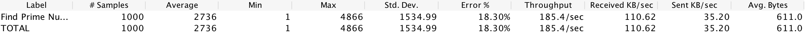
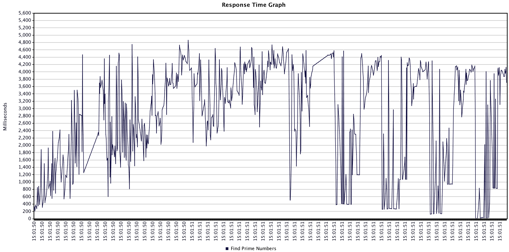
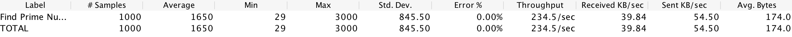
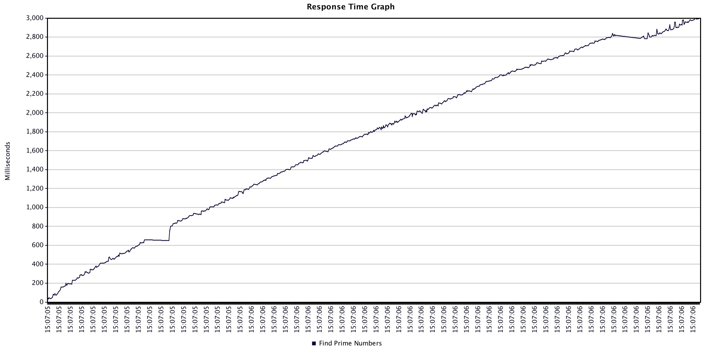
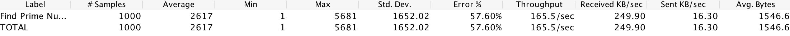
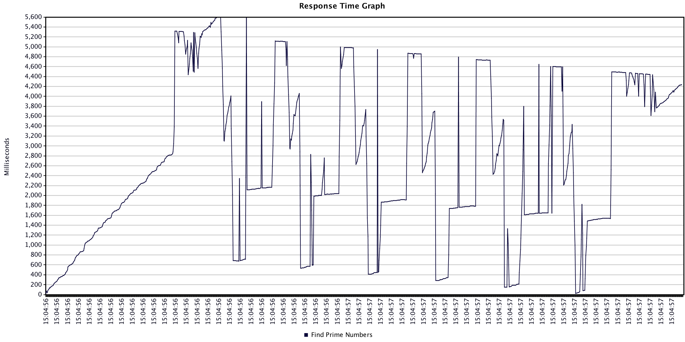

# Perf Results
This performance tests sees how fast apps can:
- accept json post which includes min: 1, max: 100,000
- finds all prime numbers between min and max
- return the number of prime numbers found

Each app was started, then given a few test runs before the results were recorded.

JMeter was used with 1000 threads for the thread group.

Node was tested with clustering turned on and off.

Go was ~12% faster than Node with no clustering.

Node with clustering was ~26% faster than go, with constantly increasing response times.

## Go
```go
func findPrimeNumbers(response http.ResponseWriter, request *http.Request) {
	...
	min := jsonObject.Min
	max := jsonObject.Max
	primesArray := getPrimeNumbersBetween(min, max)
	result := FindPrimeNumbersResponse{NumberOfPrimes:len(primesArray)}
	sendJsonResponse(response, result)
}

func isPrime(num int) bool {
	sqrtnum := int( math.Floor( math.Sqrt( float64(num) ) ) ) + 1
	prime := num != 1
	for i := 2; i < sqrtnum; i++ {
		if num%i == 0 {
			prime = false
			break
		}
	}
	return prime
}

func getPrimeNumbersBetween(min int, max int) []int{
	primes := []int{}
	for i := min; i <= max; i++ {
		if isPrime(i) {
			primes = append(primes, i)
		}
	}
	return primes
}

```




## Node with Cluster
```js
async function findPrimeNumbers(request, response){
  let requestObject = await getJsonRequest(request);
  let min = requestObject.min;
  let max = requestObject.max;
  let primesArray = getPrimeNumbersBetween(min, max);
  let result = {numberOfPrimes:primesArray.length};
  sendJsonResponse(result, response);
}

function isPrime(num) {
  const sqrtnum=Math.floor(Math.sqrt(num)) + 1;
  let prime = num != 1;
  for(let i = 2; i < sqrtnum; i++) {
    if(num % i == 0) {
      prime = false;
      break;
    }
  }
  return prime;
}

function getPrimeNumbersBetween(min, max){
  let primes = [];
  for(let i = min; i <= max; ++i){
    if(isPrime(i)){
      primes.push(i);
    }
  }
  return primes;
}
```




## Node
```js
async function findPrimeNumbers(request, response){
  let requestObject = await getJsonRequest(request);
  let min = requestObject.min;
  let max = requestObject.max;
  let primesArray = getPrimeNumbersBetween(min, max);
  let result = {numberOfPrimes:primesArray.length};
  sendJsonResponse(result, response);
}

function isPrime(num) {
  const sqrtnum=Math.floor(Math.sqrt(num)) + 1;
  let prime = num != 1;
  for(let i = 2; i < sqrtnum; i++) {
    if(num % i == 0) {
      prime = false;
      break;
    }
  }
  return prime;
}

function getPrimeNumbersBetween(min, max){
  let primes = [];
  for(let i = min; i <= max; ++i){
    if(isPrime(i)){
      primes.push(i);
    }
  }
  return primes;
}

```





