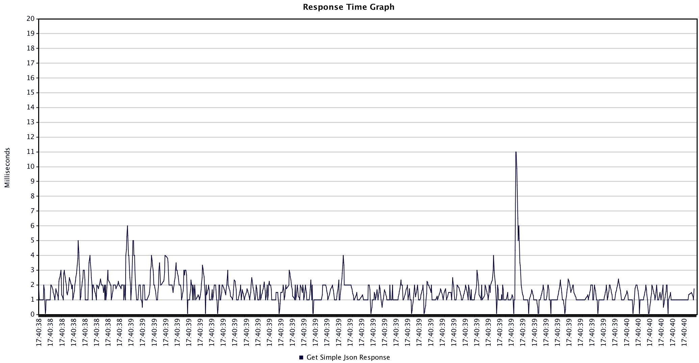

# Perf Results
This performance test sees how many requests standard go and node apps (no external frameworks or libs) can serve a simple json response from a GET endpoint.

Each app was started, then given a few test runs before the results were recorded.

JMeter was used with 1000 threads for the thread group.

Node was tested with clustering turned on and off.

Performance between Node and Go appears to be relatively the same in terms of throughput (number of requests per second)

Java throughput is a bit slower.

## Go
```go
func simpleJsonResponse(response http.ResponseWriter, request *http.Request) {
	flusher, _ := response.(http.Flusher)
	response.Header().Add("Content-Type", "application/json")
	response.Header().Add("Connection", "keep-alive")  //node does this by default
	simpleResponse := SimpleResponse{Hello:"world"}
	json.NewEncoder(response).Encode(simpleResponse)
	flusher.Flush() //transfer encoding chunked. node does this by default
}
```


## Node with Cluster
```js
 function simpleJsonResponse(request, response){
   const headers = {'Content-Type': 'application/json'};
   const simpleResponse = {hello: 'world'};
   response.writeHead(200, headers);
   response.end(JSON.stringify(simpleResponse));
 }
```


## Node
```js
 function simpleJsonResponse(request, response){
   const headers = {'Content-Type': 'application/json'};
   const simpleResponse = {hello: 'world'};
   response.writeHead(200, headers);
   response.end(JSON.stringify(simpleResponse));
 }
```


## Java
```java
 public void handle(HttpExchange t) throws IOException {
     SimpleJsonResponse simpleJsonResponse = new SimpleJsonResponse();
     simpleJsonResponse.setHello("world");
     String response = simpleJsonResponse.toJson();

     Headers headers = t.getResponseHeaders();
     headers.add("Content-Type", "application/json");
     headers.add("Connection", "keep-alive");

     t.sendResponseHeaders(200, response.length());

     OutputStream os = t.getResponseBody();
     os.write(response.getBytes());
     os.close();
 }
```




